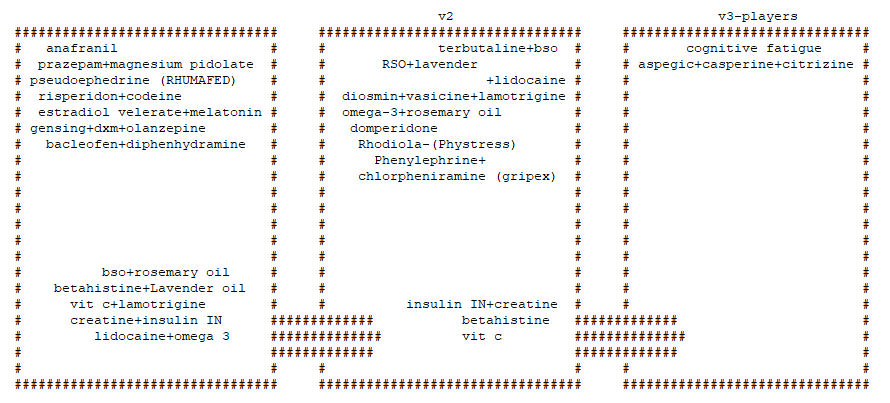
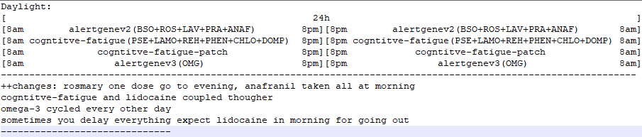
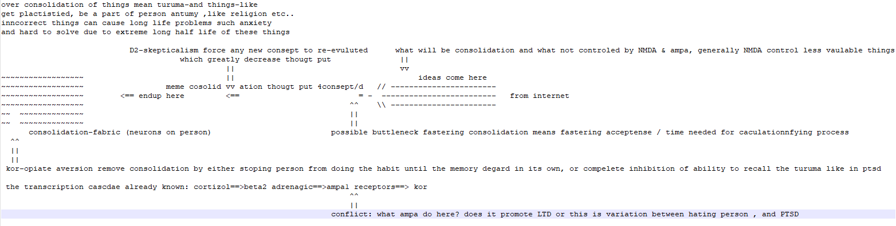
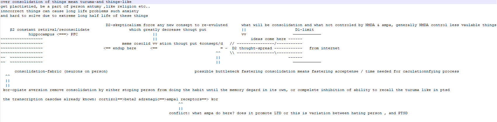

** ibtisam school **  
Spontaneous thinking  

  
  

https://en.wikipedia.org/wiki/Fluid_and_crystallized_intelligence
https://en.wikipedia.org/wiki/G_factor_(psychometrics)
https://en.wikipedia.org/wiki/Collective_intelligence

current (and well used) development phylasofy is thought-stream analyszation, using Spontaneous thinking  to reach awwerness about High-order cognitive processes
https://mycll.org/for-parents-and-teachers/higher-level-thinking/

  
  

information-gathering Arbitraty
https://www.ncbi.nlm.nih.gov/pmc/articles/PMC6083454/

Attractor network methods:
ADD: Used.
REWRITE: not used, hard on memory
DELETE: Used, in cratical cases
PRE-FLIGHT: Used, when BSO PFC Bayesian inference (intial ↑); available
GET: used, when betahistine easy navigation between strongest consolidated ideas (intial ↑, LT↑); available.
https://en.wikipedia.org/wiki/Attractor_network