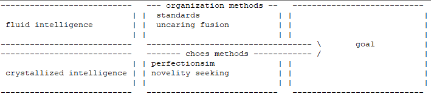

  
  
Attractor network methods:   
BACK: added  
  
dynamic headspace switching:  
  
  
due to development trace to go low signal-to-noise ration by time caffeine kicked  

criticality to monitor:
  
