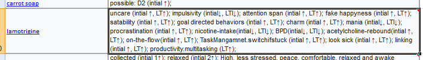
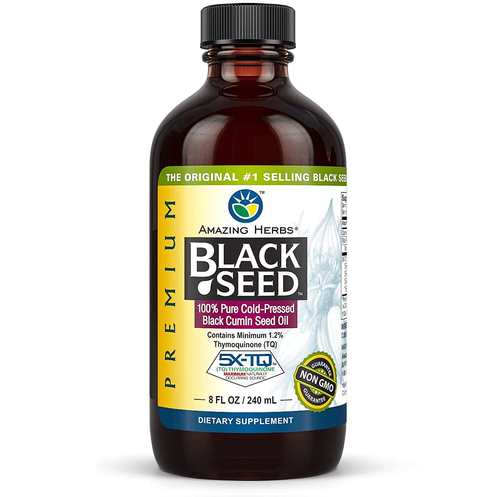
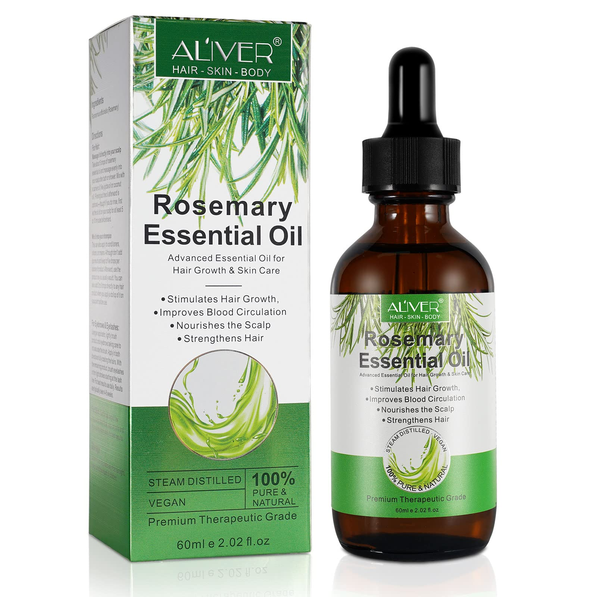

# why i'm seeing "highest clinical dose" as json key where the dose mentioned was a microdose?
>>https://www.biotune.org/2022/05/how-to-calculate-maximal-possible.html
we need to make online calculator for that someday

# what is consepted.xlsx?

its a excle file we put data in it right now until we make a json/online visualiser and consept filter for it
it made as completement for what [psychonautwiki](https://psychonautwiki.org/w/index.php?title=Subjective_effect_index&_=) started 

hint: evidence key in none_cross_tolerance_substance_list.json should link to whatever visualiser we made

for more easy research, try [this](https://github.com/ibtisammidlet/subbind/tree/main/subbind%20addon). 

anyone who started research should be on both of this substance

